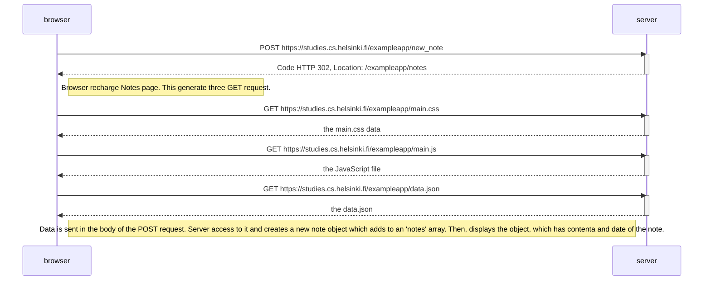

```mermaid
sequenceDiagram
    participant browser
    participant server

    browser->>server: POST https://studies.cs.helsinki.fi/exampleapp/new_note
    activate server
    server-->>browser: Code HTTP 302, Location: /exampleapp/notes
    deactivate server

    Note right of browser: Browser recharge Notes page. This generate three GET request.

    browser->>server: GET https://studies.cs.helsinki.fi/exampleapp/main.css
    activate server
    server-->>browser:  the main.css data
    deactivate server

    browser->>server: GET https://studies.cs.helsinki.fi/exampleapp/main.js
    activate server
    server-->>browser: the JavaScript file
    deactivate server
    
    browser->>server: GET https://studies.cs.helsinki.fi/exampleapp/data.json
    activate server
    server-->>browser: the data.json
    deactivate server

    Note right of browser: Data is sent in the body of the POST request. Server access to it and creates a new note object which adds to an 'notes' array. Then, displays the object, which has contenta and date of the note.
```
